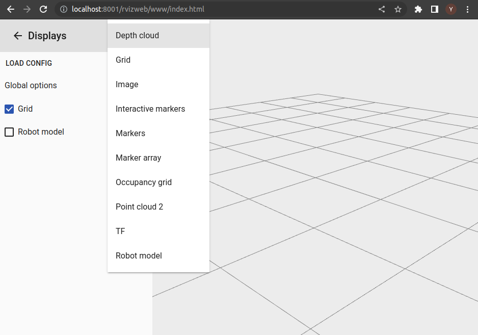
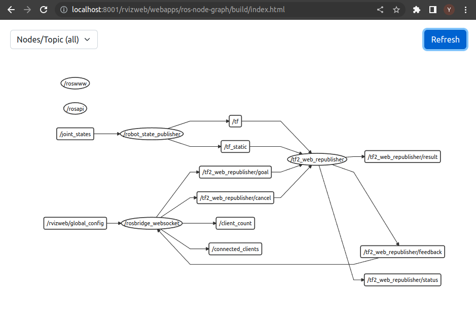

# RVizWeb - RViz, but on your browser

RVizWeb provides a convenient way of building and launching a web application
with features similar to [RViz](https://github.com/ros-visualization/rviz).

**Notes:** This repository is a update of the original [RVizweb](https://github.com/osrf/rvizweb). Fixed some web packaging dependency issues and added a new page that functions as the [rqt_graph](http://wiki.ros.org/rqt_graph) (credits to [zethus](https://github.com/rapyuta-robotics/zethus)). Tested under the Ubuntu 20.04 with ROS noetic and nodejs 18.

This project makes use of the following:
* @tork-a's [roswww](https://github.com/tork-a/roswww) web server
* @RobotWebTools's [rosbridge_server](https://github.com/RobotWebTools/rosbridge_suite)
  and [tf2_web_republisher](https://github.com/RobotWebTools/tf2_web_republisher)
* @jstnhuang's [ros-rviz](https://github.com/jstnhuang/ros-rviz) web component (In this repository, replaced to a forked repo [ros-rviz](https://github.com/yxzhan/polymer-ros-rviz))

# Quickstart

## Option 1: RVizWeb in a Docker container
### Prerequisites
* [Docker Engine](https://docs.docker.com/engine/install/)
* [Docker Compose](https://docs.docker.com/compose/)

To run `RVizWeb` inside a container use the following scripts to build and run the container:

1. Clone the repository:

        git clone https://github.com/yxzhan/rvizweb.git

2. Build the docker image:

        ~/rvizweb/docker/build.sh

3. Run the container:

        ~/rvizweb/docker/run.sh

6. Open the site on the browser
    
    Main RVizweb: http://localhost:8001/rvizweb/www/index.html

    Ros node Graph: http://localhost:8001/rvizweb/webapps/ros-node-graph/build/index.html




7. Let's try an example display to check everything is working. On the UI, click on the `+` and choose "Markers".

8. Attach a terminal to the container

        // List the running containers
        docker ps
        // Attach terminal 
        docker exec -it ${CONTAINER ID} bash

8. Run this command to publish the following marker:

        rostopic pub /visualization_marker visualization_msgs/Marker '{header: {frame_id: "base_link"}, id: 1, type: 1, action: 0, pose: {position: {x: 0., y: 0.2, z: 0.}, orientation: {x: 0.3, y: 0.2, z: 0.52, w: 0.85}}, scale: {x: 0.2, y: 0.3, z: 0.1}, color: {r: 1., g: 0., b: 1., a: 0.3}, lifetime: 50000000000}'

9. You should see a pink box show up on the site.

**Notes:** The container will share with the host network by default. And with command `xhost +local:docker`, launching gui applications (e.g., rqt_graph, rviz) inside the container should be able to X-forward to host system.

## Option 2: Install to local environment
### Prerequisites
* [Ubuntu 20.04 Desktop](https://releases.ubuntu.com/focal/)
* [ROS noetic and build tools](http://wiki.ros.org/noetic/Installation/Ubuntu)

1. Create a directory for your catkin workspace clone this repo to your existing catkin workspace:

        mkdir -p ~/ws/src
        cd ~/ws/src
        git clone https://github.com/yxzhan/rvizweb.git

2. You will need the LTS version of Node.js. Add the PPA so that `rosdep` can fetch it:

       curl -fsSL https://deb.nodesource.com/setup_18.x | sudo -E bash - && sudo apt-get install -y nodejs

3. Install ROS and system dependencies (assumes you already have ROS core):

        cd ~/ws
        rosdep install --from-paths src --ignore-src -r -y

4. Build your workspace; this will run some Javascript packaging commands like `bower`, `polymer-cli`, `react-script`
   to generate and build the frontend apps:

        cd ~/ws
        # For new catkin workspace run:
        catkin_make
        # For existing catkin workspacke run:
        catkin_make build

5. Launch RVizWeb:

        source ~/ws/install/setup.bash
        roslaunch rvizweb rvizweb.launch

6. Open the site on the browser
    
    Main RVizweb: http://localhost:8001/rvizweb/www/index.html

    Ros node Graph: http://localhost:8001/rvizweb/webapps/ros-node-graph/build/index.html

## Viewing URDF

By default, RVizWeb will serve the `share` folder of all the ROS packages that
are currently installed in the system to the following address by default:

    http://localhost:8001/<package_name/

This means that if you have robot description files installed, all these resources
will be automatically served and are ready to be used by RVizWeb.

Let's try an example using a PR2 simulated on Gazebo.

1. Install the PR2 Gazebo package:

        sudo apt install -y ros-noetic-pr2-gazebo

1. Launch the simulation:

        roslaunch pr2_gazebo pr2_empty_world.launch

1. Launch RVizWeb:

        roslaunch rvizweb rvizweb.launch

1. Open the site on the browser

    http://localhost:8001/rvizweb/www/index.html

1. On the UI, click on the `+` and choose "Robot model".

1. You should see the PR2 on the browser (it will be dark due to a texture issue).

## Viewing interactive markers

To view interactive markers, you will need an [interactive_marker_proxy](https://wiki.ros.org/interactive_marker_proxy) for
each interactive marker server you want to run, specifying a target frame and topic. You can install it from this repo https://github.com/dragandbot/interactive_marker_proxy.

By default, RVizWeb will run one of these proxies using `/base_link` as target frame and `/basic_controls` as the topic.

Let's see an example:

1. Install `interactive_marker_tutorials`:

        sudo apt install -y ros-noetic-interactive-marker-tutorials

1. Run the sample interactive marker server:

        rosrun interactive_marker_tutorials basic_controls

1. Launch Rvizweb with `interactive_markers` enabled:

        roslaunch rvizweb rvizweb.launch interactive_markers:=true

Click `+` and choose `Interactive markers`.
You should see markers all around the viewer; you can modify their poses with the controls around them!

The target frame and topic are configurable when launching the application, e.g.:

    roslaunch rvizweb rvizweb.launch interactive_markers_target_frame:=/base_footprint interactive_markers_topic:=/advanced_controls

If you need additional proxies, you can run them on separate consoles:

    rosrun interactive_marker_proxy proxy topic_ns:=/your_topic target_frame:=/your_frame

Finally, you can disable the proxy if you don't need it at all:

    roslaunch rvizweb rvizweb.launch interactive_markers:=false

## Viewing depth clouds (This feature has not yet tested)

To view depth clouds, you will need [web_video_server](https://wiki.ros.org/web_video_server) and [depthcloud_encoder](https://wiki.ros.org/depthcloud_encoder) running.

Here's a basic example using Turtlebot:

1. Install `turtlebot_gazebo`:

        sudo apt install -y ros-kinetic-turtlebot-gazebo

1. Run `turtlebot_world` in Gazebo:

        roslaunch turtlebot_gazebo turtlebot_world.launch

1. Launch RVizWeb enabling depth clouds:

        roslaunch rvizweb rvizweb.launch depth_cloud:=true

Open RVizWeb as described in [Viewing URDF section](#viewing-urdf); click `+` and choose `Depth cloud`.
You should see Turtlebot's depth cloud stream in the viewer.

Under the hood, `depthcloud_encoder` is subscribing to depth and RGB image streams and combining them into a single topic (`/depthcloud_encoded`).
You can change the default image stream sources like this:

        roslaunch rvizweb rvizweb.launch depth_cloud:=true depth_topic:=/your_depth_topic rgb_topic:=/your_rgb_topic

## Use custom configuration on startup

To launch `rvizweb` with a custom configuration you will need to provide a JSON file as argument to the launchfile:

```
roslaunch rvizweb rvizweb.launch config_file:=/path/to/config_file.json
```
or
```
roslaunch rvizweb update_config.launch config_file:=/path/to/config_file.json
```

The easiest way of generating a configuration file is the following:
- Launch `rvizweb` without any particular arguments, and open it in the browser.
- Open the components you want to be opened on start, and edit `Global options` at will.
- Click on `LOAD CONFIG` at the left panel to open the popup with the complete configuration file, and copy its contents to a local file.
- Send that file as an argument when launching the application as shown above.

**Notes:**
- Empty or undefined fields for `globalOptions` will be set to default.

